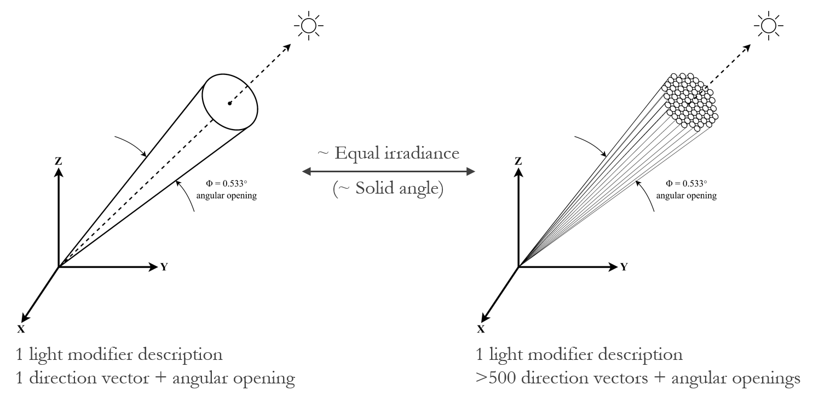

# Genmanysuns

A program to generate a Radiance sun description consisting of many mini suns.

# How to use
Save all files in ``gen_many_suns/`` to one folder on your system. Open your terminal or command prompt, navigate to the folder, and execute gen_many_suns.py by providing the name of the original (single) sun description file and the desired dimension (in pixels) of the side of the square on which the suns should be based. A dimension of 32 pixels results in 632 suns, which is deemed adequate for most applications.

Example Command:
python gen_many_suns.py original_sun_description.rad 32

- More information will be available soon at https://www.radiance-online.org/community/workshops/2023-innsbruck-austria
- ``example/`` provides a typical Radiance (single) sun description generated by Gendaylit and a sun description consisting of 632 suns, based on this file.

# Requirements
- The script currently only works for Windows.
- Radiance (with system path C:\Radiance)
- Python libraries: subprocess, shutil, math, os, re, sys, path

# License and referencing
This program has been developed by Sietse de Vries in the context of IntelLight+, an Eindhoven Engine project (partners: Signify, Eindhoven University of Technology). The program is licensed under the BSD-3 license, see the LICENSE file.
Special thanks to John Mardaljevic for his valuable contributions during the development of this method. Please refer to this program by citing: 

 
